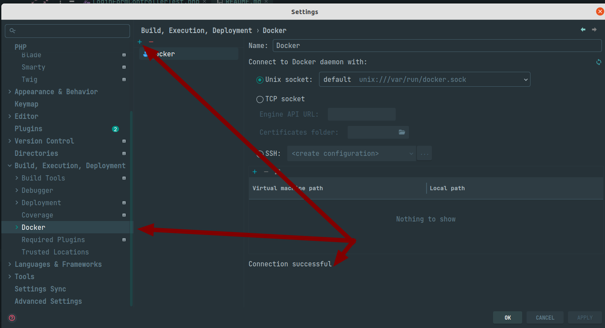
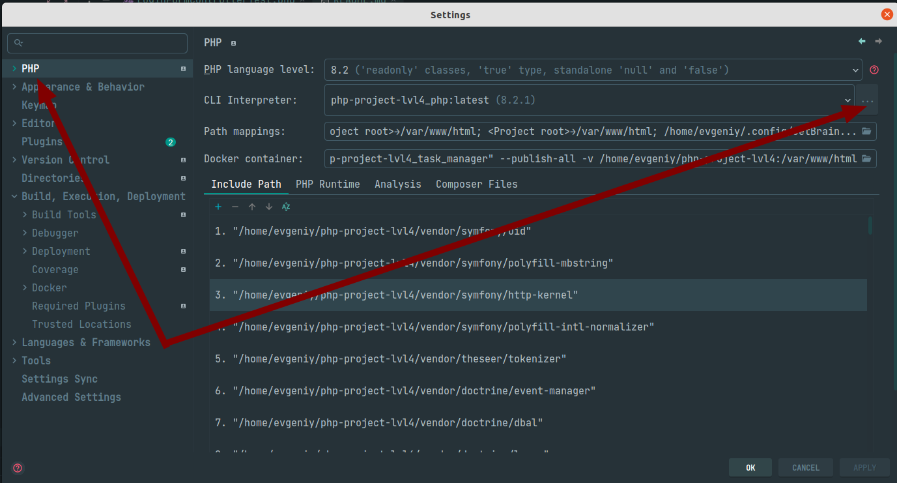
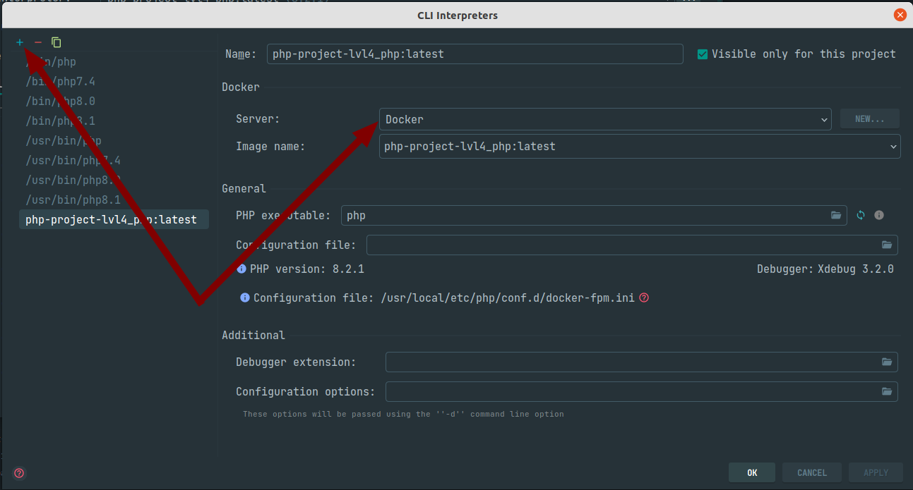
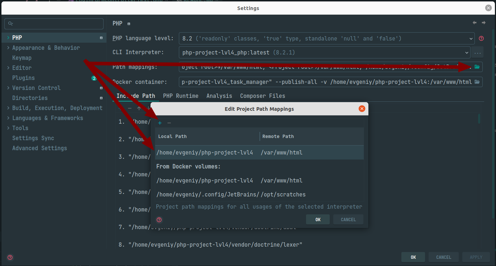
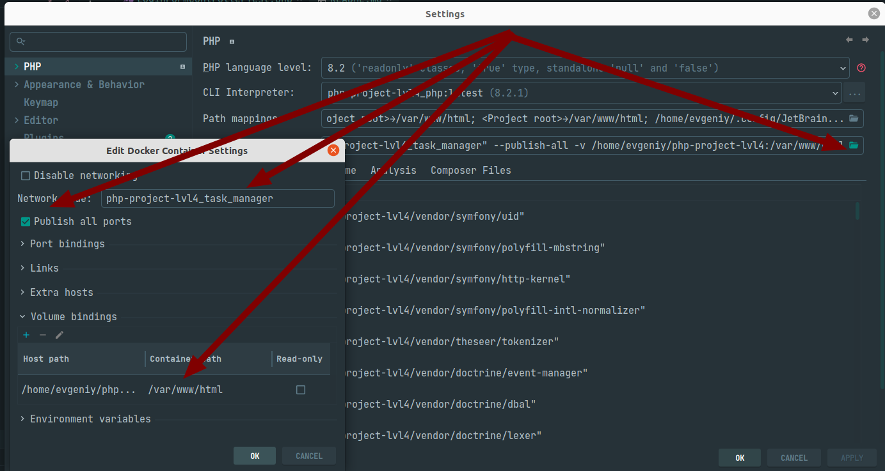

# Менеджер задач

[](https://github.com/zhekavafiev/php-project-lvl4/actions)
[](https://codeclimate.com/github/zhekavafiev/php-project-lvl4/maintainability)
[](https://codeclimate.com/github/zhekavafiev/php-project-lvl4/test_coverage)

[Ссылка для ознакомления](https://evgvfv-task-manager.herokuapp.com/)

## Назначение
Приложение разработано в качестве pet проекта.

## Установка
1. `git clone https://github.com/zhekavafiev/task-manager-laravel.git`
2. `make install` 

### Создание фейковых данных в базе
```php artisan create:baseDatabaseData```

Проверить работоспособность приложения можно, запустив локальный есервер `make server` или тесты `make test`.

## Создание PHPDoc моделям
php artisan ide-helper:models

## Испоользование MiniO
Доступ к хранилищу осуществляетя по адресу http://localhost:9001
Логин user
Пароль userpwd123

## Настройка PHPStorm
### Настройка интерпретатора

PhpStorm > Preferences







### Тестирование внутри контейнеров
1. Установка Маппинга


2. Установка сети и прав на подключения внутри сети. Для этттого предварительно необходимо посмотреть название сети docker network ls


